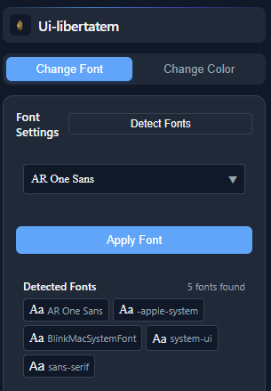
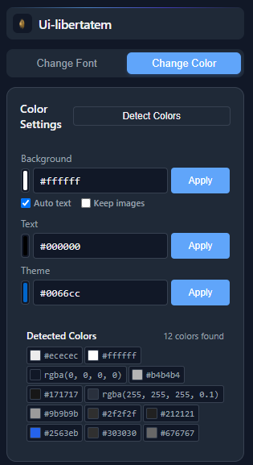

# Ui-libertatem Chrome Extension

<div align="center">
  
  <h3>Customize web fonts and colors with ease</h3>
</div>

## Overview

Ui-libertatem is a powerful Chrome extension that allows users to customize web page fonts and colors in real-time. With advanced detection capabilities, it provides an intuitive interface for changing website appearance while maintaining readability and design consistency.

## Screenshots

### Font Changer
<div align="center">
  
  <p><em>Font detection and customization interface</em></p>
</div>

### Color Changer
<div align="center">
  
  <p><em>Color detection and customization interface</em></p>
</div>


## Features

### Font Management 🔤
- **Smart Detection**: Automatically identifies all fonts used on the current webpage
- **System & Google Fonts**: Access to both system fonts and Google Fonts library
- **Live Preview**: Preview fonts before applying them
- **Categories**: Filter fonts by type (Serif, Sans-serif, Display, Script, etc.)
- **Search**: Quick font search functionality
- **Cross-platform**: Works across different websites and platforms

### Color Management 🎨
- **Color Detection**: Identifies all colors used on the webpage
- **Background Colors**: Change page background with smart contrast
- **Text Colors**: Modify text colors while maintaining readability
- **Theme Colors**: Apply consistent theme colors across elements
- **Image Handling**: Option to preserve or modify image backgrounds
- **Platform-specific**: Optimized for popular websites (YouTube, Twitter, etc.)

## Installation

1. Download from Chrome Web Store (Coming Soon)
2. Or install manually:
   ```bash
   git clone https://github.com/yourusername/ui-libertatem.git
   cd ui-libertatem
   npm install
   npm run build
   ```
   Then load the `dist` folder in Chrome as an unpacked extension

## Usage

### Font Customization
1. Click the extension icon
2. Select "Change Font" tab
3. Click "Detect Fonts" to see current page fonts
4. Choose a font from the dropdown or detected fonts
5. Click "Apply" to change the page fonts

### Color Customization
1. Click the extension icon
2. Select "Change Color" tab
3. Click "Detect Colors" to see current page colors
4. Use color pickers for:
   - Background color
   - Text color
   - Theme color
5. Toggle options for:
   - Auto text contrast
   - Image preservation
6. Click "Apply" to update colors

## Technical Stack

- **Frontend**: React + TypeScript
- **Build Tool**: Vite
- **Extension**: Chrome Manifest V3
- **Features**:
  - MutationObserver for dynamic content
  - Platform-specific selectors
  - Google Fonts API integration
  - Real-time color detection
  - Font fingerprinting
  - Cross-origin iframe support

## Platform Support

The extension includes optimized support for:
- YouTube
- Twitter/X
- Facebook
- LinkedIn
- Gmail
- Reddit
- Google
- Netflix
- Amazon

## Contributing

Contributions are welcome! Please feel free to submit issues and pull requests.

<div align="center">
  Made with ❤️ by Yonas Kumelachew<br>
  <sub>A project to make the web more customizable</sub>
</div>